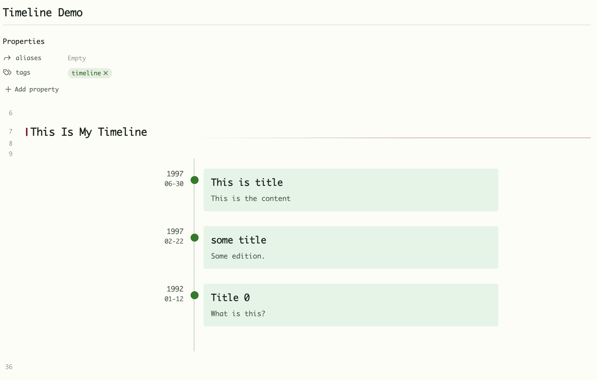

# Markdown Timeline

Convert markdown files into timeline visualizations within Obsidian.



## Features

- Convert markdown content into visual timelines
- Simple and intuitive markdown syntax
- Interactive timeline view
- Customizable styling
- Chronological sorting of events

## Installation

1. Open Obsidian Settings
2. Go to Community Plugins and disable Safe Mode
3. Click Browse and search for "Timeline"
4. Install the plugin and enable it

## Usage

### Basic Timeline Creation

Create a timeline by using a code block with the `timeline` language identifier:

~~~
```timeline
# 2024-03-15
## Event Title
Content

---

# 2024-01-01
## Another Event
More content here
```
~~~

### Syntax Structure

Each timeline event follows this structure:
- `# YYYY-MM-DD` - The date of the event
- `## Title` - The event title
- Content - The event description, can be markdown content
- `---` - Separator between events

## Support

If you encounter any issues or have suggestions:
1. Check the [GitHub Issues](https://github.com/recklyss/obsidian-timeline/issues)
2. Create a new issue if needed

## License

MIT License - see [LICENSE](LICENSE) file for details

